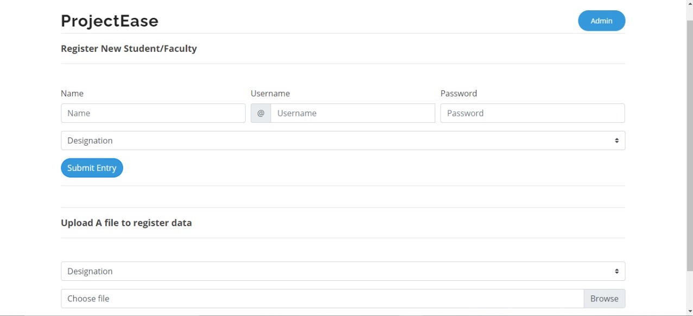

# ProjectEase - Project Manageing Protal

```
ProjectEase is a management web application for institutions like universities, Schools, or industries.
It will allow the Faculty to easily manage Projects, Student's information, Performance etc. Students
will be able to upload their projects on the portal and update it as more features are added. The prof-
-essors can easily see all the projects of different students/teams organised in one place. They can -
-review them and give feedback to the students. Project Ease will also have features to mark and a-
-nalyse the projects. Visual representation of the projects and data like graphs, Pie chart, Bar graph
etc will be available. The faculty will be able to keep track of the Student's progress with ease
```
---
## SILENT FEARURES

1. Interactive and easy to use GUI.
2. Provided Friendly Collaborative Environment.
3. Helps you manage time better.
4. Faculty-Student Centred.


---

# Why we are making ProjectEase
```
we feel that ProjectEase is a very interactive platform to collaborate
with friends and be engage with some good projects with faculties,
collage seniors, phd scholars. In most of the universities and collages
faculties work on very innovative projects and while working with
them Students can learn a lot. through this platform we tried to
strengthen the bond between faculty and students and tried our best to make the learning experience even better.
```

---
# Screenshots

---

---

---

---

---

# Contribution
```
Whoever wants to make ProjectEase even better will be welcomed warmly.
Let's reshape Education - Team ProjectEase.
```
